# Chess GUI
Object Oriented Programming Group Project

**Team name:** Team 11

**Team members' names.**: Kevin Bryniak, Hector Guzman, Josh Phammington

**Semester, course number, and section number:** Fall 2024, CS-3354, 006

### Class Diagram
[View online here](https://www.mermaidchart.com/app/projects/0acf9f86-ecc0-4848-9400-3caa51772ab6/diagrams/f8159727-3f89-43ef-bb13-71288b9324f1/version/v0.1/view)


### Compile & Run
The entrypoint of this application is the `Game` class. Compile all files in the board, gui, pieces, and theme packages, then compile the Game class.

```
javac -d ./bin board/*.java gui/*.java pieces/*.java theme/*.java Game.java
java -cp ./bin Game 
```

Or, you can run the `Chess.jar` file provided directly.


### Features
- Drag and drop
- Click to move
- Extensible theming/styling
- Load/save to/from file
- Move history
- Captured piece history
- Undo moves
- Resizable display
